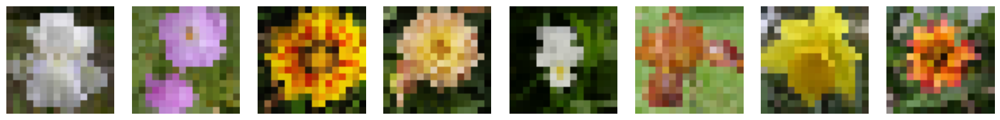
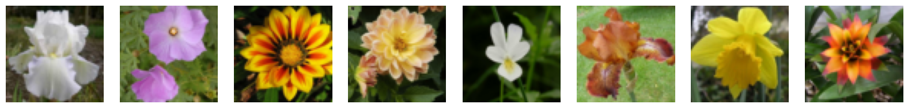

# Diffusion-based superresolution 
 
This repository contains an implementation of [Denoising Diffusion Implicit Models (DDIM)](https://arxiv.org/abs/2010.02502) for the superresolution problem.

## 4x Superresolution

### Dataset: Oxford Flowers 102

* 80% of all dataset were used for training
* The remaining 20% were used for testing
* 64x64 resolution, center cropped
* 50 diffusion steps were used for testing

**Input images**

**Output images**

**Target images**

## Requirements
* Keras 3

## Acknowledgments
Our code is highly inspired by [clear-diffusion-keras](https://github.com/beresandras/clear-diffusion-keras/tree/master).